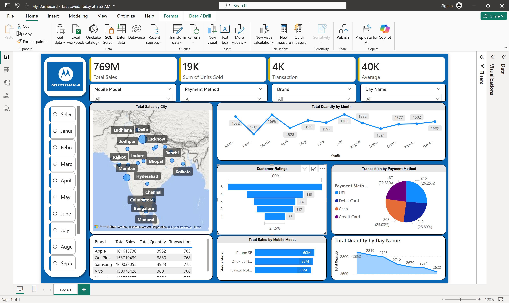

# Sales Data Analysis Dashboard

## 📌 Project Overview
This project is built using Power BI and Microsoft Excel to analyze sales performance and generate business insights through an interactive dashboard.

## 🛠️ Tools Used
- Microsoft Power BI
- Microsoft Excel

## 📊 Dashboard Features
- Total Sales
- Total Profit
- Sales by Category
- Sales by Region
- Monthly Sales Trend
- Interactive Filters (Slicers)

## 📁 Files Included
- Sales Dashboard.pbix
- Sales_Data.xlsx
- Dashboard_Screenshot.png

## 🎯 Skills Demonstrated
- Data Cleaning
- Data Visualization
- Dashboard Design
- Business Analysis
- Power BI
- Excel

## 👨‍💻 Author
Rohit Sharma

## 📷 Dashboard Preview

